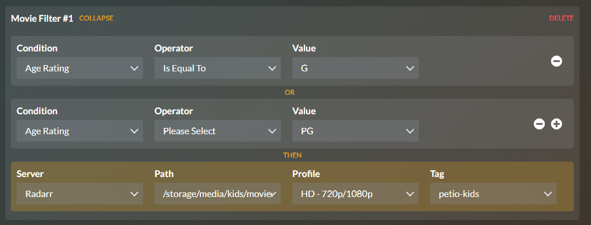
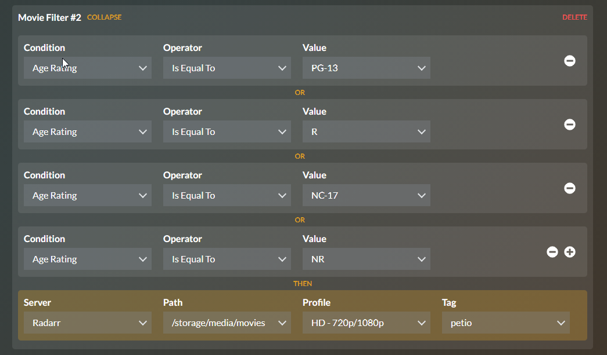

# Filters

Filters are way you can control how your requests get handled. Think of it like another layer of automation on top of Radarr/Sonarr. 

Let's say you like to separate your media based on age rating, either you have kids or know someone with kids. Filters allow you to be granular about where requested "kid content" gets placed including Radarr/Sonarr server \(if you have multiple ones configured\), path, and/or tag. You can use the available operands `AND`/`OR`to determine how many things must be evaluated true before Petio sends the request to Sonarr/Radarr with the specified paths, profile, and/or tags.

Filters can be used with age ratings, genre, language, and keywords! We hope to revamp filters in the future so stay tuned! 

For those of you using `AND`/`OR` operands for the first time I'll provide a quick explanation of each. Any one of the `OR` conditions can trigger a match whereas an `AND` operator must always be true for the entire filter to match. Most of the time, you want to use `OR` instead of `AND` otherwise, you'll stare at your screen wondering why it isn't working. If you have questions how to configure filters, please stop by our [Discord](https://discord.gg/bseGmrUd3N) and ask some questions!

Below you can find an example of how a kid's filter would work versus an adult one:

