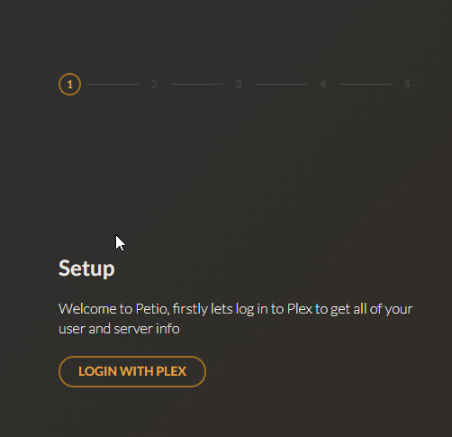
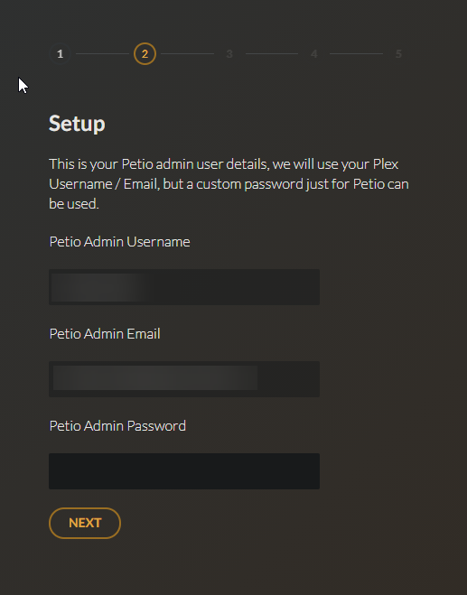
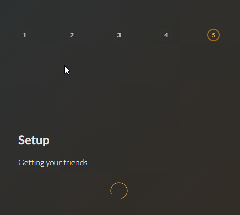

# First Time Setup

## Step 1

Click `Login With Plex` and follow the steps to log in.

## Step 2

After you log in with Plex you will need to specify your Petio specific admin credentials, by default it uses your Plex username and email but you still need to specify your own password.

## Step 3

After setting up your credentials, you need to pick your Plex server.

## Step 4

Once you select your server, you need to configure how Petio will connect to your database. You will either use the self-hosted MongoDB instructions or the remote hosted MongoDB database instructions for your OS.


* If you are using the MongoDB Remotely option click on `mongo://` to switch it to `mongo+srv://` and copy the connection string from Atlas, without the `mongo+srv://` and `/test`. 
* Replace the `<password>` with your password. The syntax should be user:password@cluster.mongodb.net.
  * If your password contains any special characters you should encode it using [URLEncoder](https://www.urlencoder.org/).


## Step 5

If you configured everything correctly, the last screen should look like this.

## Step 6

Once the last step is finished, you will be presented with a login screen. Use your Plex username and the password you set up on Step 2. You can now get started with configuring Radarr, Sonarr and start requesting!

