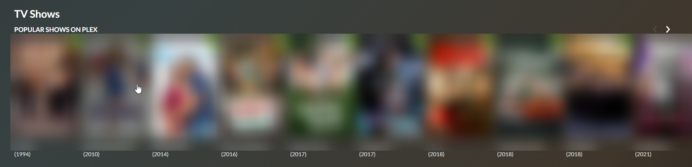
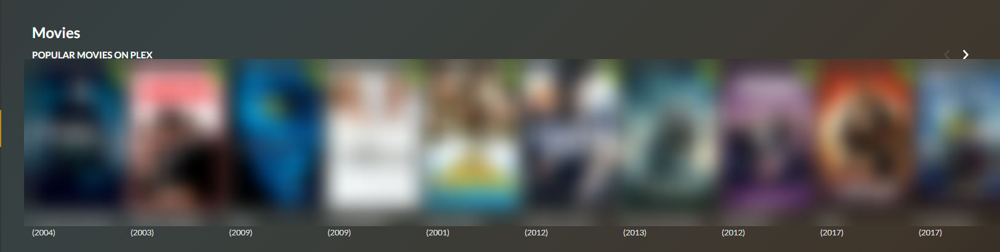

# General Settings

## Settings

The settings tab is where you will configure your general settings such as email, webhooks, base path \(subdirectory\), etc.

### Base Path

A base path is helpful if you are wanting to serve Petio behind a reverse proxy using the subdirectory method, otherwise known as a `base URL`, `base path`, or `subdirectory`. Please see our reverse proxy section for more information and examples.

### User Login

This setting will determine which login method is used to login to Petio. For the admin panel you will **always** need a username/password if you don't use Plex oAuth.

However, for the user panel you can specify `Standard Login` or `Fast Login`. The difference is that with `Fast Login` your users will only need to specify their Plex email/username whereas with `Standard Login` they will need to use your Plex email/username and password.

### Popular Content On Plex


This feature **requires** Plex Pass 


Adds the most popular Movies and TV Shows on Plex in the last 30 days based on user plays. It shows up when you click on the Movies/TV section

