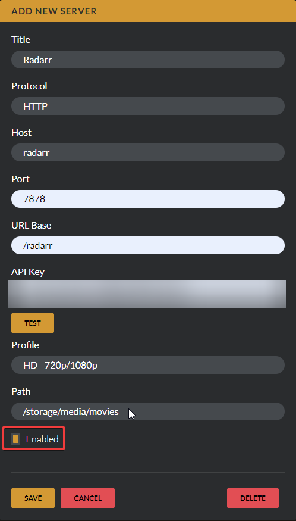

# Radarr

You can add multiple Radarr servers to your Petio instance. This will show you how to connect an existing Radarr server to Petio.


We only support Radarr V3.



In the screenshots below we assume you are using locally accessible docker containers that are on the same docker network as Petio.


## Step 1

Click on `Add New`

## Step 2

After clicking `Add New` you need to specify all your Radarr settings and give it a friendly name you can recognize. Your `host` and `port` fields will vary depending on what installation method you chose.

If you are hosting Radarr behind a reverse proxy and have configured a base URL, you need to specify it on the `URL Base` field. If this all sounds like alien speak, you don't have to write anything there.

You can obtain your Radarr API key by going to your Radarr instance and clicking on `Settings > General`.

## Step 3

Hit `Test` to make sure you configured it correctly. You will not be able to configure your `Profile` and `Path` without testing the connection ahead of time. You should see a little message on the bottom right that says `Radarr Test Connection success!`

Once you are done hit `Save` and you are ready to requests movies!

