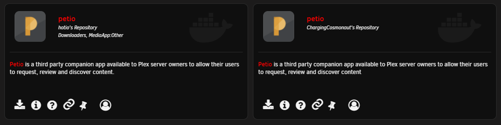

# UnRAID

## MongoDB

### Community Applications

* Go to the Apps page within unRAID and search for `MongoDB`. 


You will have to set permissions on the appdata folder yourself. The MongoDB container does not have any logic in it to set the ownership. 


* There are two ways to do the permissions for this.
  * In Extra Parameters \(you will have to enable the advanced view\), set `--user 99:100` to run it as the user most containers created by the community run as. If you choose this - in your terminal run `chown nobody:users /mnt/user/appdata/mongodb/`
  * If you choose not to set the Extra Perameters - in your terminal run `chown 999:999 /mnt/user/appdata/mongodb/`


If you are using a different path, make sure you adjust the command as necesary.


* Make sure to restart the container after running the `chown` command

## Petio

There are two ways to get Petio installed on unRAID. You can either import your own template or install it from the Community Applications plugin.

### Community Applications

* Go to the Apps page within unRAID and search for `Petio`. You can use either use ChargingCosmonaut's \(Official\) or Hotio's template.

* Configure the container like all the others on unRAID.

Once you've completed theses steps, you can navigate to `http://<hostname>:7777` to start [configuring Petio](../configuration/first-time-setup.md).

### Template

* Add the repo to `Template Repositories` under the Docker header:
  * [https://github.com/PotentialIngenuity/petio-unraid](https://github.com/PotentialIngenuity/petio-unraid)

* Click on`Add Container`

* Configure the container like all the others on unRAID.

