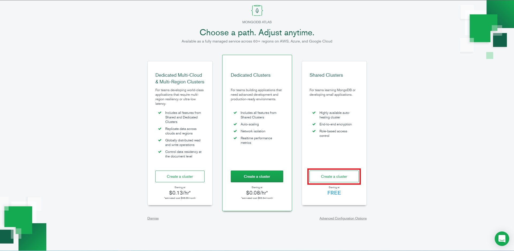
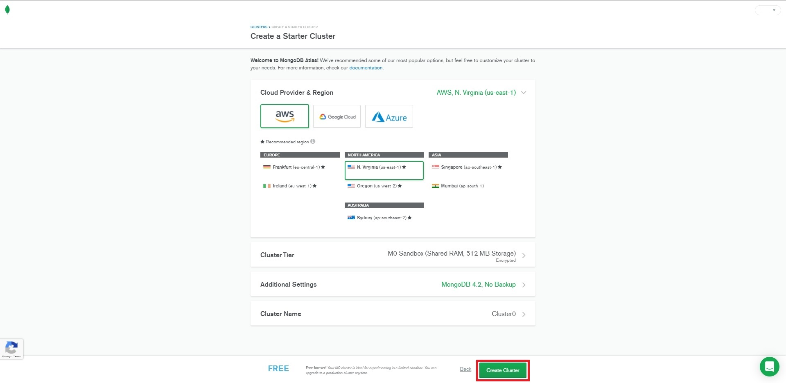
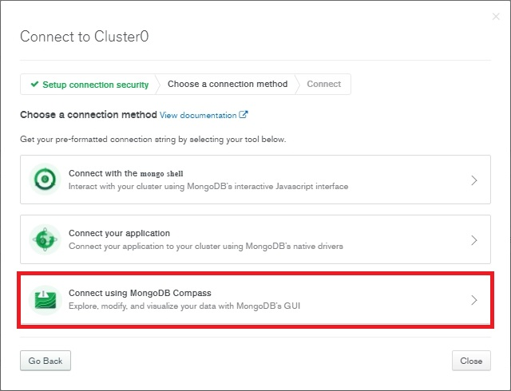

# Windows

## Installation

The recommended installation order is to choose which way you prefer to run Mongo, host it locally or remotely. Secondly, we recommend you install Petio as a service so it can start automatically everytime your system boots up. We recommend either [NSSM](windows.md#nssm) or [Shawl](windows.md#shawl).

## Mongo

Petio supports two ways of connecting to a Mongo Database instance, locally or remote. We recommend the locally hosted MongoDB option.

### MongoDB Locally

* Download MongoDB Community Server [here](https://www.mongodb.com/try/download/community) \(make sure to choose version 4.4.7\). That version only support Windows 10 and Server 2019. If you are on older OS, you need to download Community Server Edition v4.2.
* Install MongoDB using the default instructions on screen.
* Download the latest version of [Petio](https://petio.tv/releases/latest) and decide which installation method you prefer
  * [NSSM](windows.md#nssm)
  * [Shawl](windows.md#shawl)
* Once this is complete, you can navigate to `http://hostname>:7777/admin/` to start [configuring Petio](../configuration/first-time-setup.md). When you get to the MongoDB setup, instead of `mongo:27017` use `localhost:27017`.

### MongoDB Locally - On A Different Host

* Please review the [Linux guides](linux/debian-ubuntu.md#mongodb-locally-on-a-different-host) and make changes as necessary for your situation.

### MongoDB Remotely

* Register for Atlas [here](https://www.mongodb.com/cloud/atlas/register).
* Create a free cluster.



* Change the provider or region if you need to. It may take some time to create the cluster.



* After the cluster is made, click on connect and select MongoDB Compass and follow the instructions on screen.



* Download the latest version of [Petio](https://petio.tv/releases/latest) and decide which installation method you prefer
  * [NSSM](windows.md#nssm)
  * [Shawl](windows.md#shawl)

## Petio as a Service

First of all, download the Petio binaries from the [downloads page](https://petio.tv/downloads/) and extract the zip file to a convenient location. \(We recommend at the root of your `C:` drive, i.e: `C:\Petio`.\) Note that the folders from the zip file \(`config` and `views` at the time of this writing\) need to stay in the same folder as the binary itself.

### NSSM

* Download the latest release of [NSSM](https://nssm.cc/download).
* Extract the zip folder anywhere you want on your system. We recommend the root of your `C:\` drive on a folder called `NSSM`.
  * Add the `NSSM` folder to your Windows Path.
    * Go to Control Panel &gt; System &gt; Advanced System Settings
    * Click on `Environment Variables` at the bottom
    * Under `System Variables` scroll down until you see `Path` and double click on it
    * Click `New` and type `C:\NSSM`
* To start the installion of Petio as a service type:

```text
nssm install petio
```

* In the `Application` tab make sure  to specify the path to`Petio.exe` and then click install service.
* To start the service use:

```text
nssm start petio
```

* To check if the service is up and running use:

```text
nssm status petio
```

* If you later wish to remove this service use:

```text
nssm remove petio
```

* Once this is complete you can navigate to `http://<hostname>:7777/admin/` to start [configuring Petio](../configuration/first-time-setup.md).

### Shawl

* Grab the latest release of [Shawl](https://github.com/mtkennerly/shawl/releases).
* Shawl is portable, so place it anywhere you want on your system; we recommend the root of your `C:\` drive in a folder called `Shawl`.
* Open up an administrator command prompt and navigate to the directory where you placed Shawl. In our case:

```text
cd C:\Shawl
```

* Create a service for Petio with Shawl using the command:

```text
shawl.exe add --name Petio -- "C:\path\to\petio.exe"
```

* Then, start the Petio service like so \(if you used PowerShell, replace `sc` by `sc.exe`\):

```text
sc start Petio
```

* To stop Petio, use

```text
sc stop Petio
```

* Once this is complete you can navigate to `http://<hostname>:7777/admin/` to start [configuring Petio](../configuration/first-time-setup.md) or by viewing the `.log` file that Shawl created for Petio in the same directory where you placed Shawl.

### Reverse Proxy

You have the ability to serve Petio behind a reverse proxy. This is inherently more secure as you are not having to punch holes through your router's firewall or your Windows' firewall for every service you want to access remotely. By serving services behind a reverse proxy you are filtering all the traffic to ports 80/443. We recommend you read over our reverse proxy section. We have some helpful examples and there is even one [specific to Windows](../reverse-proxy/caddy.md).

## Updating Petio

* Download latest binaries from [here](https://petio.tv/releases/latest/).
* Stop Petio or the Petio service.
* Replace  the "views" folder and "petio-win" with contents from the zip you downloaded.
* Now you're all done. Just fire up Petio again.

